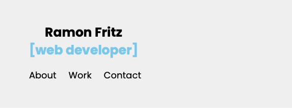

# Weekly Challenge 2

## Working with CSS Challenge: Portfolio Website 

## Contents
* [Description](#description)
* [Approach](#approach)
* [Challenges](#challenges)

## Description

The project centres around the creation of a portfolio website showcasing personal development projects by utilising CSS grid and Flex flows.

## Links

[Ramon Fritz | Portfolio Website](https://urbanpatrol.github.io/working-with-css-challenge/challenge/index.html)

### Acceptance Criteria

The acceptance criteria are defined as follows:
* When the page is loaded the page presents your name, a recent photo or avatar, and links to sections about you, your work, and how to contact you.
* When one of the links in the navigation is clicked then the UI scrolls to the corresponding section.
* When viewing the section about your work then the section contains titled images of your applications.
* When presented with the your first application then that application's image should be larger in size than the others.
* When images of the applications are clicked then the user is taken to that deployed application.
* When the page is resized or viewed on various screens and devices then the layout is responsive and adapts to my viewport.

## Approach
* Build out the basis of a website with header and footer along with navigational elements.
* Utilise grid elements for the portfolio section of the website rendering the site responsive throughout (some suggested using Flexbox but I chose not to purely as a decision to further my knowledge).
* Use media queries to render break points for content display thereby ensuring content integrity via respective devices.
* Semantic HTML elements - to give the code more structure and to make it easier to find items for future use. The following elements were introduced header, nav, article, aside and footer. This is used ultimately to help accessibility readers and search engines identify areas of content. 
* Reviewing and amending as required the logical structure of HTML elements ensuring integrity.
* Ensuring that the image and icon elements contain accessible 'alt' attributes as best practice for accessibility.
* Reviewing the heading attributes thereby ensuring they follow sequentially.
* Ensuring all elements are clear and concise and carry a descriptive title where applicable.

## Challenges
#### *Grid*
It is a huge leap from editing existing code to producing code from scratch and I struggled initially with getting started.

Although I believe the site responds acceptably it is small things like centering navigation with media queries where I spent more time than necessary trying to resolve.

I would have liked to push this further into mobile responsive for smaller screens which it largely is but small issues are prevalent that could easily be resolved with more time and knowledge.

However, with all of the above, I believe that all acceptance criteria have been met.   

The following continues to be a useful resource:
* [W3School CSS Tutorial](https://www.w3schools.com/css/)
* As well as Kevin Powell's YouTube channel although a little advanced, there are some good snippets.

## Credits

* Many thanks to Dan and the TA's for their incredible patience.
* StackOverflow is an invaluable resource...again! :)
* W3School as always... a great resource.
* ...and the hundreds of internet contributors I searched to find solutions... too many to mention.

## License

n/a

## Features

* The website is a simple responsive portfolio site with navigational points to respective areas of content.
* The site is responsive with breakpoints at 600px rendering the large hero image, work portfolio elements and header responsive.
* Links from content are used only as an example at present until a portfolio is built up... watch this space!

## Tests

* Validation was done for the CSS using the [W3C CSS Validation Service](https://jigsaw.w3.org/css-validator/validator).
* When validating the HTML, I am presented with an error for the id="headline-work-small" (lines: 51, 57, 63, 69) which is the small overlay tabs on the portfolio images. I understand these are repeated several times but is the validator always correct? I may need to rethink the format.

---

© 2022 Ramon Fritz. Confidential and Proprietary. All Rights Reserved. 